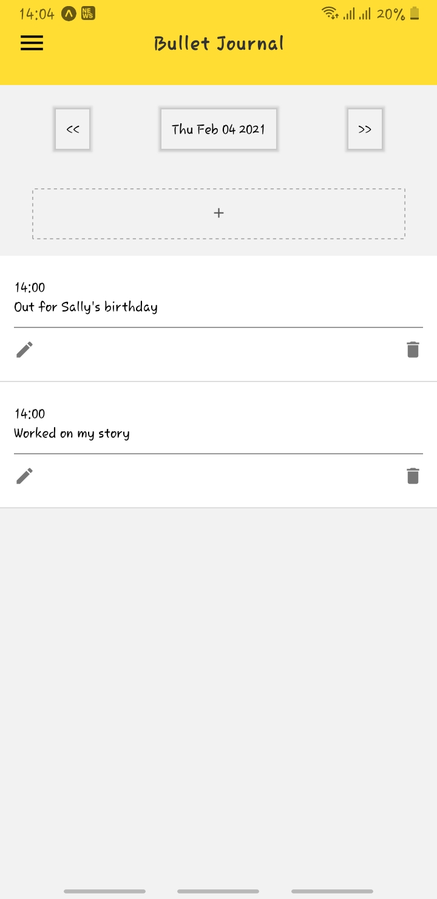
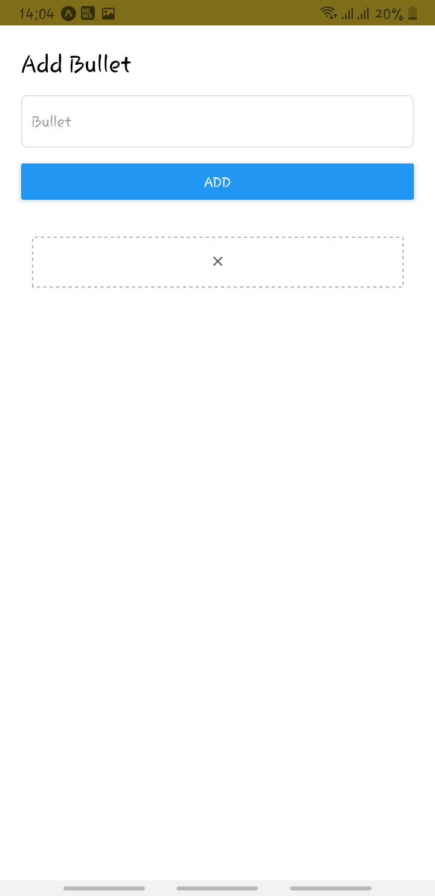
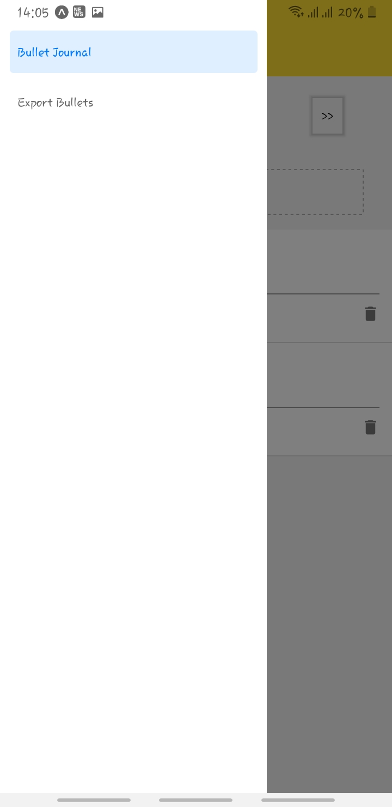

# Bullet Journal

1. [Introduction](#introduction)
2. [Getting Started](#getting-started)
3. [Usage](#usage)
4. [Screenshots](#screenshots)
5. [Dependencies](#dependencies)

## Introduction

Bullet Journal is a mobile application that you can use to store daily journals as bullets.

Using the application, you can:
1. Add bullets for each day.
2. Choose a date to view bullets for that date.
3. Export bullets for each day.

## Getting Started

1. Clone the repo

2. In the project directory, install all the dependencies using:

  `yarn`

3. Run the project using:

  `yarn start`

4. The app server runs on http://localhost:19002/.

5. Install Expo Go ([Android](https://play.google.com/store/apps/details?id=host.exp.exponent), [iOS](https://apps.apple.com/us/app/expo-client/id982107779)) on your phone.

6. Open the **Expo** app.

7. Scan the QR code shown on your browser or terminal.

## Usage

The app opens with the current date. Here, you can:

1. Add/Edit/Delete **Bullets**.
2. Go to next or previous date.
3. Choose a new date using a date picker.
4. Go to the **Export** page, where you can:
  - Select the date for which to export bullets.
  - Export bullets to an external API.
  - Export bullets on your own device.

## Screenshots

1. Home screen

2. Add new bullet

3. App drawer

4. Export bullets

## Dependencies
1. @react-native-async-storage/async-storage ^1.13.2
2. @react-native-community/datetimepicker ^3.0.8
3. @react-native-community/masked-view 0.1.10
4. @react-navigation/drawer ^5.11.4
5. @react-navigation/native ^5.8.10
6. expo ~40.0.0
7. expo-status-bar ~1.0.3
8. react 16.13.1
9. react-dom 16.13.1
10. react-native https://github.com/expo/react-native/archive/sdk-40.0.1.tar.gz
11. react-native-gesture-handler ~1.8.0
12. react-native-reanimated ~1.13.0
13. react-native-safe-area-context 3.1.9
14. react-native-screens ~2.15.0
15. react-native-web ~0.13.12
